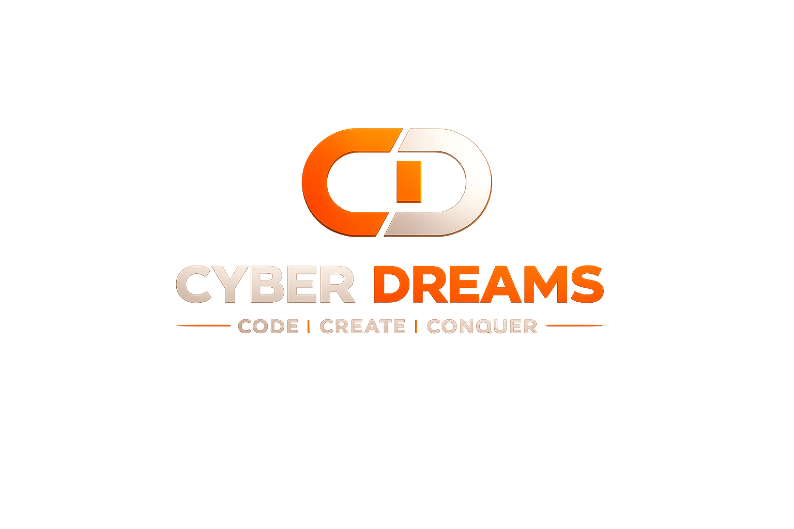

# 🚀 CYBER DREAMS - Premium Software House Website



## 🎯 Overview

A cutting-edge, futuristic website for **Cyber Dreams** - a premium software house specializing in:
- **Software Development** (Core Service)
- Networking Solutions
- CCTV & Surveillance Systems
- IT Services

## ✨ Features

### 🎨 Design
- **Ultra-modern futuristic UI** with dark theme and orange accents
- **Glassmorphism effects** with backdrop blur
- **Neon glow effects** on interactive elements
- **Particle.js background** for dynamic atmosphere
- **Smooth animations** using AOS and GSAP
- **Parallax scrolling** effects
- **Custom cursor** for desktop users
- **Fully responsive** design (mobile-first approach)

### 🎵 Background Music
- Auto-play background music with user interaction fallback
- Mute/Unmute toggle button
- Volume control slider
- Browser autoplay policy compliant

### 📄 Sections
1. **Hero Section** - Animated intro with logo and tagline
2. **About Us** - Company introduction and values
3. **Services** - Four main services with detailed descriptions
4. **Why Choose Us** - Animated counters and key strengths
5. **Portfolio** - Project showcase with hover effects
6. **Contact** - Contact form with WhatsApp integration
7. **Footer** - Complete site navigation and social links

### 🔒 Security & SEO
- `robots.txt` - Search engine optimization
- `security.txt` - Security contact information
- `web.config` - IIS configuration with:
  - HTTPS redirect
  - Security headers (CSP, HSTS, X-Frame-Options, etc.)
  - GZIP compression
  - Static file caching
  - Custom error pages

## 📁 Project Structure

```
cyberdreams_website/
├── index.html              # Main HTML file
├── robots.txt              # SEO configuration
├── security.txt            # Security contact info
├── web.config              # IIS server configuration
├── README.md               # This file
└── assets/
    ├── images/
    │   ├── logo.png        # Company logo
    │   └── office.png      # Office image
    ├── audio/
    │   └── bg_music.mp3    # Background music
    ├── css/
    │   └── style.css       # Custom styles
    └── js/
        └── main.js         # JavaScript functionality
```

## 🛠️ Technologies Used

### Frontend
- **HTML5** - Semantic markup
- **Tailwind CSS** - Utility-first CSS framework
- **Custom CSS** - Advanced styling and animations
- **JavaScript (Vanilla)** - Core functionality

### Libraries & Frameworks
- **Particles.js** - Animated particle background
- **AOS (Animate On Scroll)** - Scroll animations
- **GSAP** - Advanced animations
- **Font Awesome** - Icons
- **Google Fonts** - Typography
  - Orbitron (headings)
  - Rajdhani (subheadings)
  - Space Grotesk (body text)

## 🚀 Getting Started

### Prerequisites
- A modern web browser (Chrome, Firefox, Safari, Edge)
- A local web server (optional but recommended)

### Installation

1. **Clone or download** the repository
2. **Navigate** to the project folder
3. **Open** `index.html` in your browser

### Running with a Local Server (Recommended)

#### Using Python:
```bash
# Python 3
python -m http.server 8000

# Python 2
python -m SimpleHTTPServer 8000
```

#### Using Node.js (http-server):
```bash
npx http-server -p 8000
```

#### Using PHP:
```bash
php -S localhost:8000
```

Then open `http://localhost:8000` in your browser.

## 📱 Responsive Breakpoints

- **Desktop**: 1200px and above
- **Tablet**: 768px - 1199px
- **Mobile**: Below 768px

## 🎨 Color Scheme

```css
Primary Color:   #ff6b00 (Orange)
Secondary Color: #00d4ff (Cyan)
Accent Color:    #ff00ff (Magenta)
Dark Background: #0a0a0a
Text Primary:    #ffffff
Text Secondary:  #b0b0b0
```

## 📞 Contact Information

- **Phone/WhatsApp**: [03175648951](tel:03175648951)
- **Email**: [muneebbaig200@gmail.com](mailto:muneebbaig200@gmail.com)
- **WhatsApp Direct**: [Click to Chat](https://wa.me/923175648951)

## 🌟 Key Features Breakdown

### Animations
- **Preloader** with cyber-themed loading animation
- **Glitch effect** on hero title
- **Floating logo** animation
- **Scroll-triggered** animations on all sections
- **Hover effects** on cards and buttons
- **Counter animations** for statistics
- **Parallax scrolling** on hero and about sections

### Interactivity
- **Sticky navigation** with scroll detection
- **Active link highlighting** based on scroll position
- **Mobile hamburger menu** with smooth transitions
- **Smooth scroll** to sections
- **Scroll-to-top** button
- **Contact form** with validation
- **Music controls** with volume adjustment

### Performance
- **Lazy loading** for images
- **Optimized animations** using requestAnimationFrame
- **GZIP compression** enabled
- **Static file caching** configured
- **Minified libraries** from CDN

## 🔧 Customization

### Changing Colors
Edit the CSS variables in `assets/css/style.css`:
```css
:root {
    --primary-color: #ff6b00;
    --secondary-color: #00d4ff;
    --accent-color: #ff00ff;
    /* ... */
}
```

### Updating Content
- **Company info**: Edit text in `index.html`
- **Services**: Modify service cards in the services section
- **Portfolio**: Update project cards in the portfolio section
- **Contact details**: Update phone/email in contact section

### Adding Social Links
Update the footer social links in `index.html`:
```html
<div class="social-links">
    <a href="YOUR_FACEBOOK_URL" class="social-link">...</a>
    <!-- Add more social links -->
</div>
```

## 📊 Browser Support

- ✅ Chrome (latest)
- ✅ Firefox (latest)
- ✅ Safari (latest)
- ✅ Edge (latest)
- ✅ Opera (latest)

## 🚀 Deployment

### For IIS (Windows Server)
1. Copy all files to your IIS web directory
2. The `web.config` file will automatically configure:
   - HTTPS redirect
   - Security headers
   - Compression
   - Caching

### For Apache
Create a `.htaccess` file with similar configurations to `web.config`

### For Nginx
Configure your `nginx.conf` with appropriate headers and redirects

### For Static Hosting (Netlify, Vercel, GitHub Pages)
Simply upload all files - no additional configuration needed

## 📝 License

© 2026 Cyber Dreams. All Rights Reserved.

## 🤝 Support

For support or inquiries:
- Email: muneebbaig200@gmail.com
- Phone: 03175648951
- WhatsApp: [Chat Now](https://wa.me/923175648951)

---

**Built with ❤️ by Cyber Dreams Team**

*CODE • CREATE • CONQUER*
